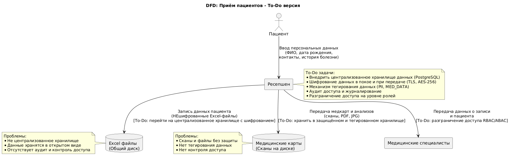

# Конфиденциальные данные, которые не учтены во внутренних системах

### Персональные данные пациентов:
- ФИО
- Дата рождения
- Контактные данные: телефон, e-mail
- Адрес прописки и фактический адрес
- Место работы / учебы
- История заболеваний, хронические болезни
- Результаты анализов и медицинские карты
- Договоры и контракты на обслуживание

### Персональные данные сотрудников:
- ФИО
- Паспортные данные (если хранятся)
- Зарплатные данные, налоги
- Учётные записи для доступа к IT-системам

### Финансовые данные:
- Платежи пациентов
- Расчёты с сотрудниками (зарплаты, налоги)

### Технические данные:
- Логи доступа к системам
- IP-адреса и данные аутентификации пользователей

# Описание Data Flow Diagrams (DFD)
Для каждого бизнес-процесса предполагается создание отдельной диаграммы. Ниже — краткий обзор процессов и данные для DFD.

| Процесс                    | Входные данные                         | Выходные данные / Результат             | Системы / Хранилища                   |
| -------------------------- | -------------------------------------- | --------------------------------------- | ------------------------------------- |
| Приём пациентов (ресепшен) | Личные данные пациента, запись к врачу | Запись в журнале приёма, контракт       | Excel файлы, сканы, общий диск        |
| Медицинское обслуживание   | Медкарта, анализы, диагнозы            | Медкарты, анализы в сканах              | Excel, PDF, JPG на общем диске        |
| Учёт платежей (кассиры)    | Данные по оплатам                      | Отчёты по оплатам                       | Excel, 1С Бухгалтерия                 |
| Бухгалтерский учёт         | Платежи, зарплаты, налоги              | Финансовые отчёты, налоговая отчётность | 1С Бухгалтерия                        |
| Учёт ТМЦ (склад)           | Данные о товарах и оборудовании        | Отчёты по запасам, закупкам             | 1С Торговля и склад                   |
| IT-администрирование       | Логи, аутентификация                   | Аудит, мониторинг                       | Active Directory, Exchange, серверы   |
| Интеграция с лабораторией  | Запросы анализов, результаты           | Результаты анализов для пациентов       | API лаборатории, порталы, базы данных |
| Клиентский портал          | Записи пациентов, личные данные        | Запись на приём, уведомления            | Новый портал, мобильное приложение    |

Рассмотрим DFD процесса приема пациентов:

