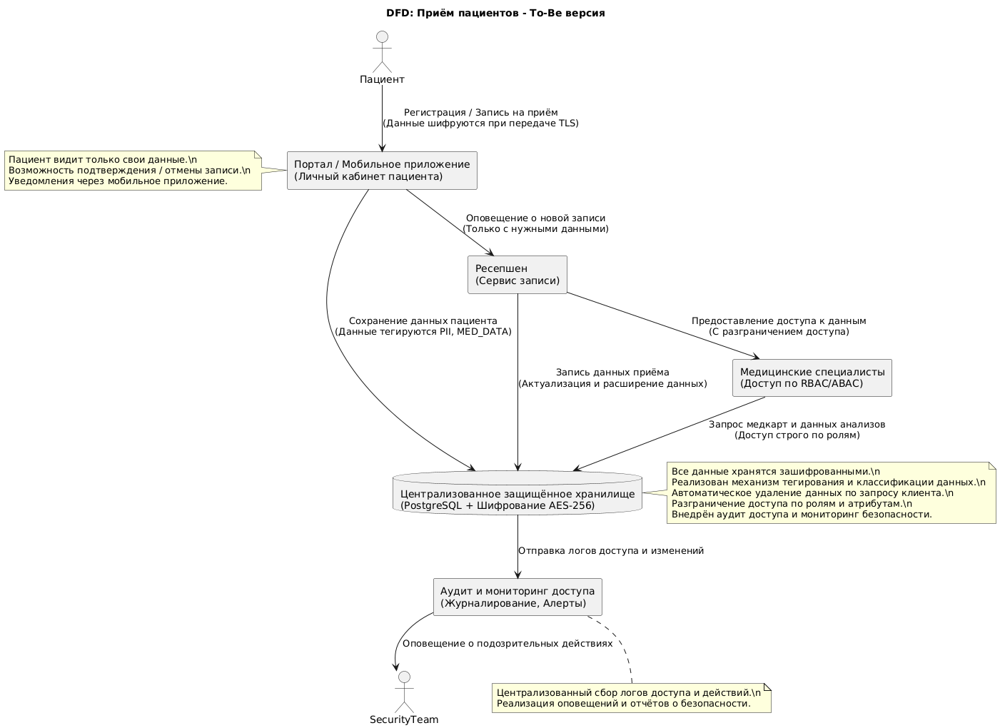

## Предложения по улучшению защиты данных
- Персональные данные:	Шифрование в базе и при передаче (TLS, AES-256)
- Медицинские данные:	Обезличивание / псевдонимизация при аналитике
- Платёжные данные:	Токенизация
- Данные доступа (логи):	Централизованный аудит, защита от изменений
- Данные пользователей:	RBAC/ABAC разграничение доступа

## Рекомендуемые инструменты и меры
- Система управления доступом: RBAC/ABAC (например, Keycloak или Open Policy Agent).
- Централизованное хранилище данных: СУБД (PostgreSQL) с шифрованием.
- Безопасный API-шлюз: с аутентификацией и авторизацией.
- Мониторинг и аудит: Elastic Stack (ELK) или специализированные решения.
- Обеспечение конфиденциальности: использование технологий шифрования, токенизации, анонимизации.
- CI/CD и конфигурируемость: хранение политик безопасности и правил в конфиг-файлах.
- Обучение сотрудников: политика работы с конфиденциальными данными и регулярные тренинги.

## Доработанная диаграмма DFD процесса приема пациентов:

